# 数字图像处理报告

## 摘要：

本文将利用VS平台和c++ 以及Opencv开源库基于频域滤波对图像进行一系列操作，设计的滤波器包括： butterworth and Gaussian低通滤波器， butterworth and Gaussian高通滤波器，拉普拉斯和Unmask高通滤波器等。

## 题目一：butterworth and Gaussian低通滤波器

### 1.butterworth低通滤波器简介

Butterworth低通滤波器函数为：

从函数图上看，更圆滑，用幂系数n可以改变滤波器的形状。n越大，则该滤波器越接近于理想滤波器

### 2.Gaussian低通滤波器简介

Guassian低通滤波器函数为：

 

 1减去低通滤波模板即可得到高通滤波模板

### 3.处理结果

从左到右是原图，原图频域图，处理后图片，处理后图片频域图（以下皆如此，不再复述）

#### test1（Gasussian）

D0=20；a=0.0862473

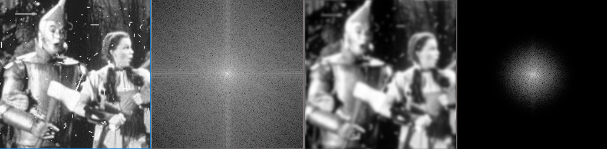

D0=50；a=0.269272

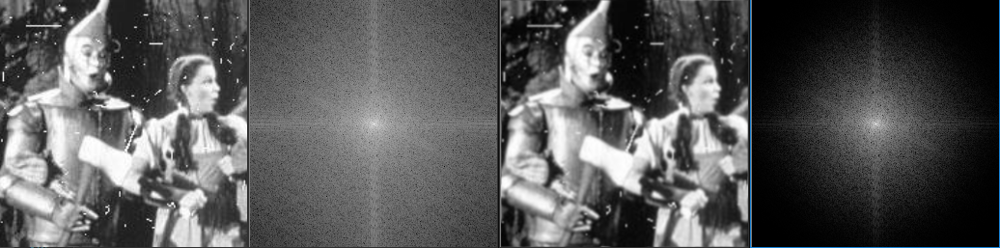

D0=100；a=0.415389 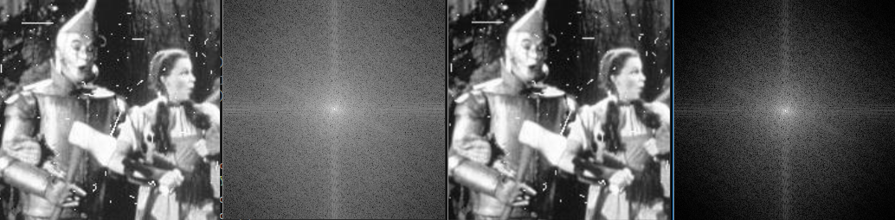

#### test1（2阶butterworth ）

D0=20；a=0.074178

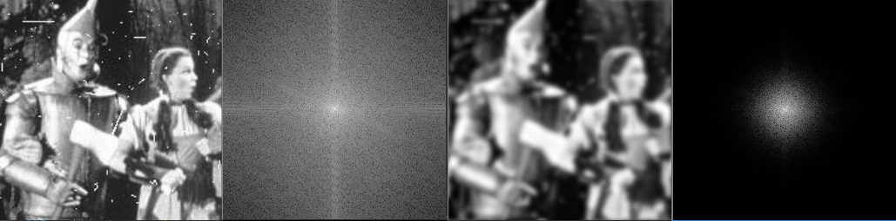

D0=50；a=0.220215

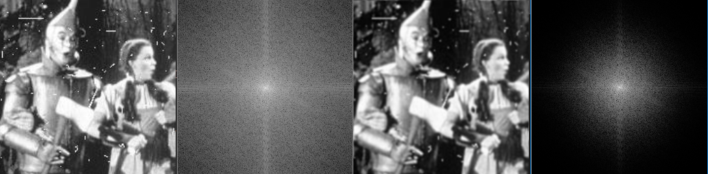

D0=100；a=0.388685

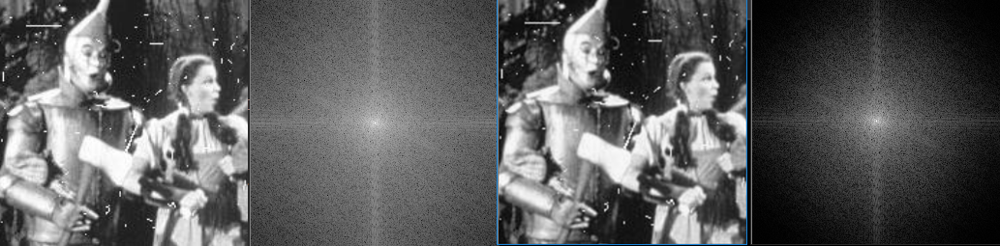

#### test2（Gasussian）

D0=20，a=0.0264465

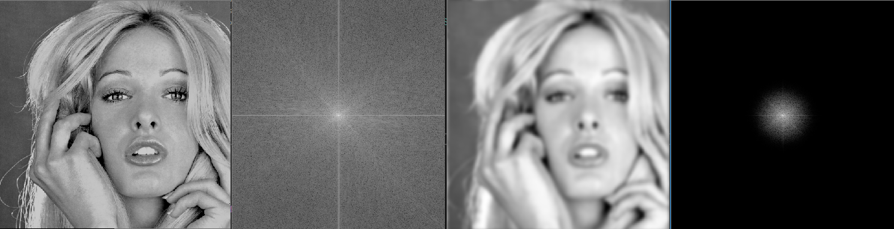

D0=50，a=0.107402

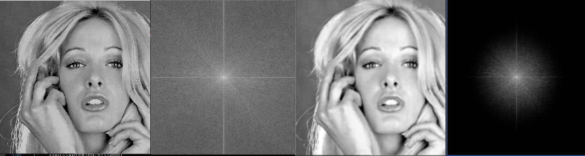

D0=100；a=0.294774

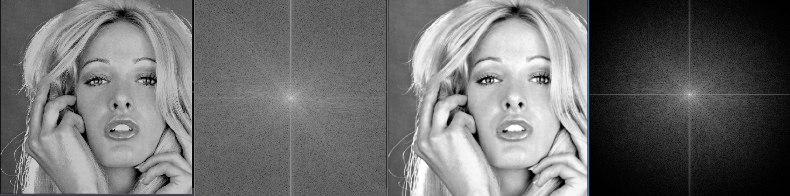

#### test2（2阶butterworth）

D0=20,a=0.0257519

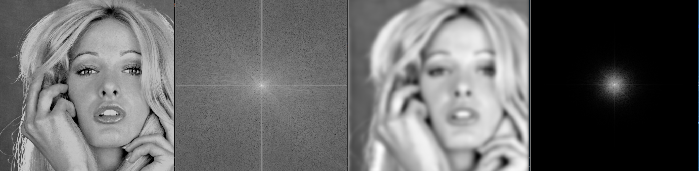

D0=50,a=0.103681

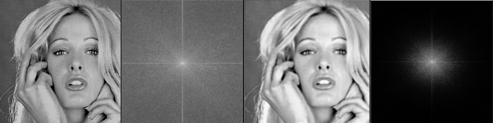

D0=100,a=0.241536

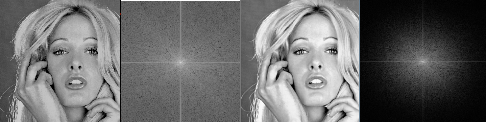

### 4.结果分析

​                                                                                                                                                                                                                                                                                                                                                                                                                                                                                                                                                                                                                                                                                                                                                                                                                                                                                                                                                             1.横向比较可得，不论是巴斯沃德还是高斯滤波器，我们都可以看到，高频分量可以被滤去，当D0越小时，处理之后的图像越模糊，边界越不明显。同时，D0越小，功率谱比越小。

2.纵向比较可得，二阶巴斯沃德和高斯滤波器的效果差不多，都可以平滑图像，滤去高频分量，但是功率比有些差别，原因是其两者滤波器的过渡带的差异。

## 题目二：butterworth and Gaussian高通滤波器

### 1.butterworth and Gaussian高通滤波器简介

由题一的简介可得，butterworth and Gaussian高通滤波器即是1-H（v,u）（H（v,u）为低通滤波器的函数）在这不再累述。

### 2.处理结果

#### test3（Gaussian）

D0=20，a=0.539859

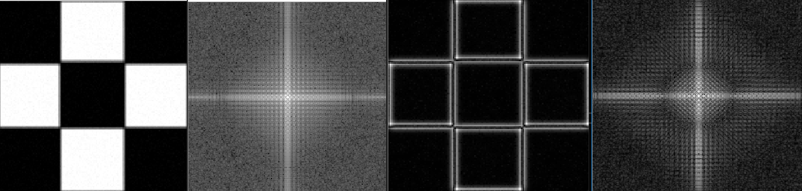

D0=50，a=0.659422

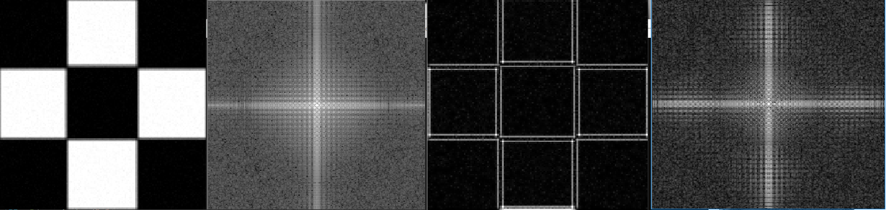

D0=100，a=0.708183

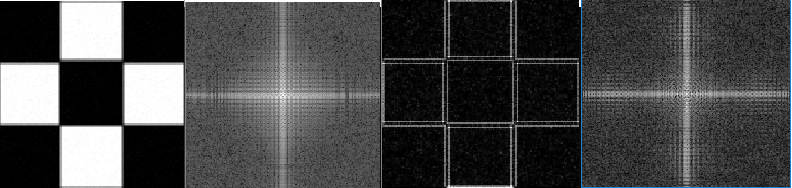

#### test3（2阶butterworth）

D0=20，a=0.543607

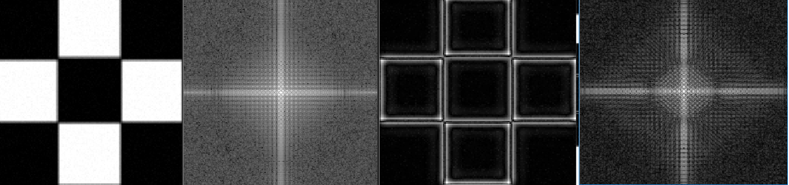

D0=50，a=0.659205

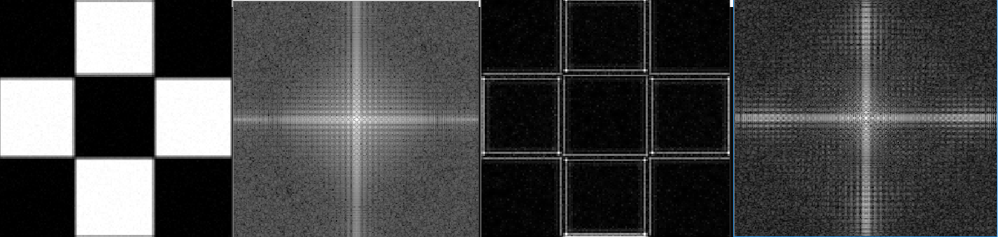

D0=100，a=0.722848

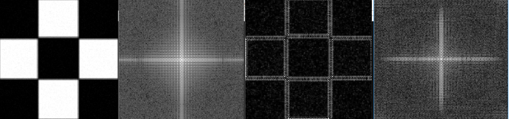

#### test4（Gaussian）

D0=20，a=0.628655

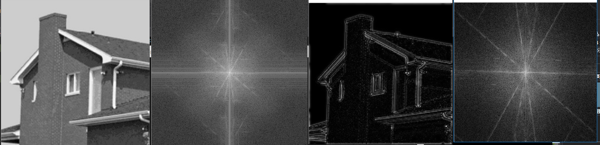

D0=50，a=0.690491

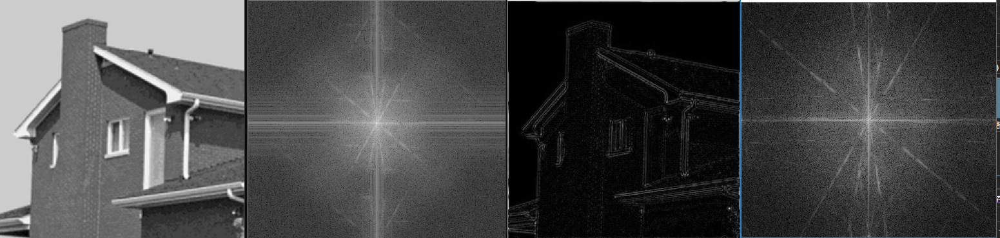

D0=100, a=0.691478

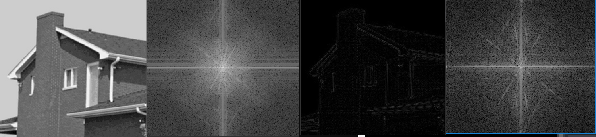

#### test4（2阶butterworth）

D0=20,a=0.612067

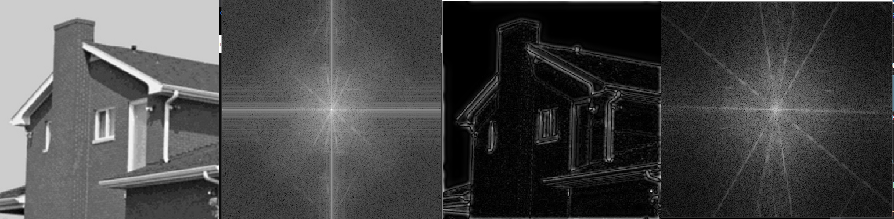

D0=50,a=0.711846

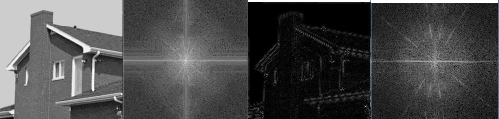

D0=100,a=0.700887

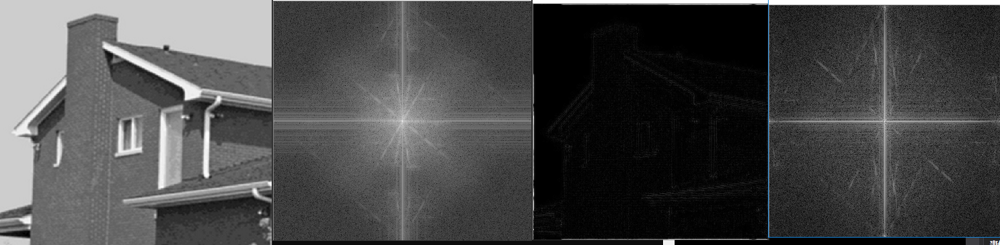

### 3.结果分析

1.横向比较我们可以知道，和低通相反，d0越大其功率比越大，同时，当D0越大，图像的越暗，可知大部分能量被滤掉。

2.纵向比较，根据结果，我们知道二者的作用都是保留高频分量，滤去低频分量，因此将边缘凸显了出来，但是由于其的过渡带的差异导致了其同一截止频率的功率比不一样。

## 题目四：拉普拉斯和Unmask高通滤波

### 1.拉普拉斯高通滤波

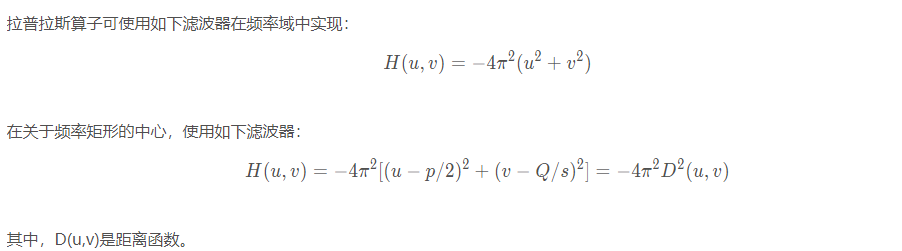

### 2.Unmask高通滤波

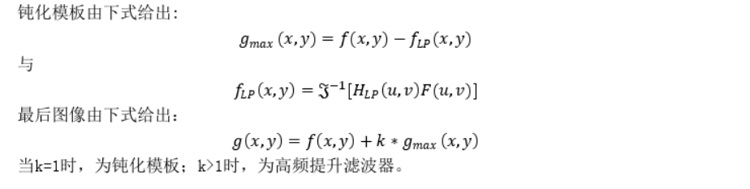

### 3.处理结果

#### test3（laplace）

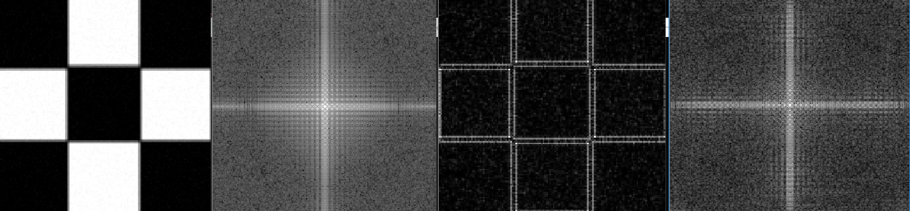

#### test4（laplace）

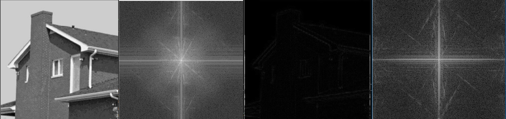

#### test3（Unmask)

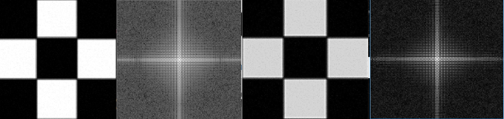

#### test4(Unmask)

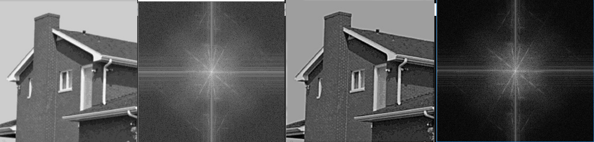

### 4.结果分析

1.可以看见两个滤波器都有边缘增强的效果。

2.可见laplace对直流的抑制比之前的巴斯沃德和高斯分量更强。Unmask由于加上了直流分量，因此并无图像偏暗的情况。但是出现了过度锐化的情况，导致有多重轮廓。

## 空域 和频域滤波的比较

  空域滤波和频域滤波的转换为卷积定理，空域滤波器和频域滤波器的互相为傅里叶变换和反变换。空域的f(x,y)和h(x,y)卷积，便是频域F(x,y)和H(x,y)相乘。

  空域的锐化模板对应频域的高通滤波，目的是提取图像的边缘。空域的平滑对应于频域的低通滤波。

  区别：空域的操作对应的是基于部分像素的操作，而频域是对整个图像中的数据。可以提高其的整体的特性。

   

